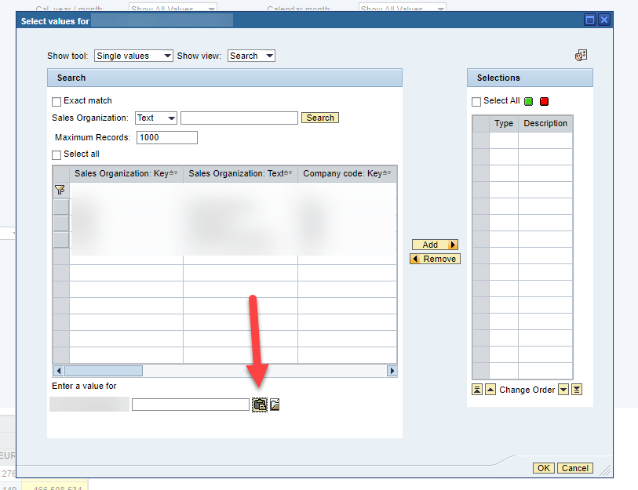

( **English** )

# Fix for BI page
Currently the BI portal has a fault, the paste from clipboard isn't working. This is a temp fix.
Just paste to any field and the current clipboard will be paste split by ;.

Now you don't even need to open a separate popup.

1. This extension fix this button: 
    

# Chrome Store
https://chrome.google.com/webstore/detail/x

# Todo
- [x] Fix a tool over 2k employees use and is not given enough attention.

# Description for Chrome Store
[./chrome-store/description/en.txt](./chrome-store/description/en.txt)